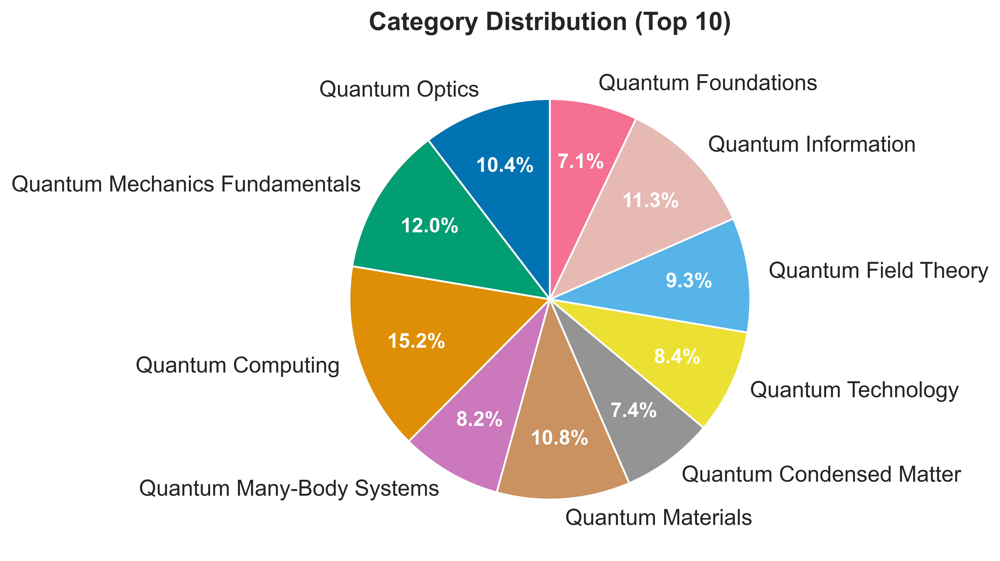
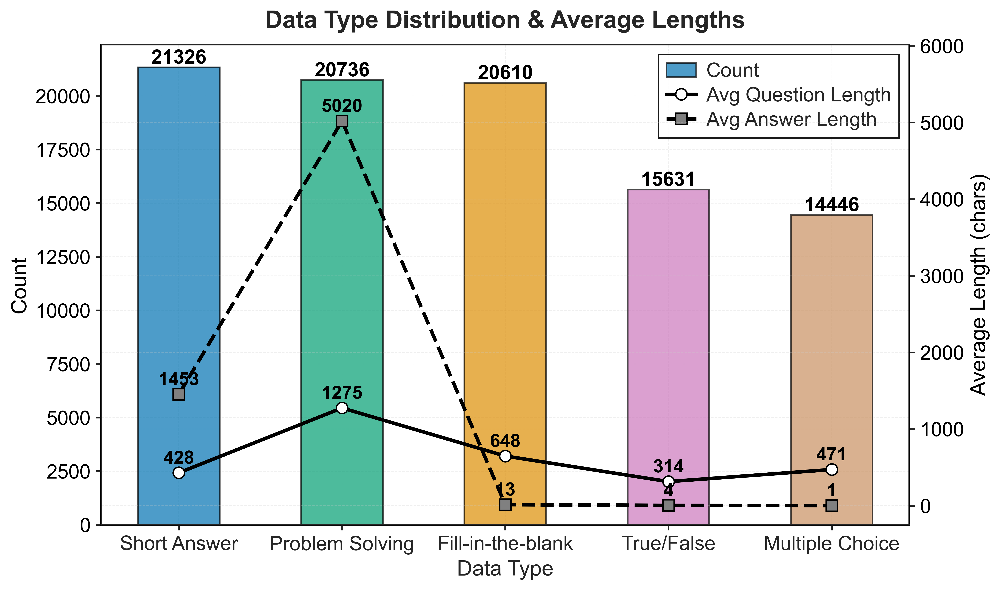
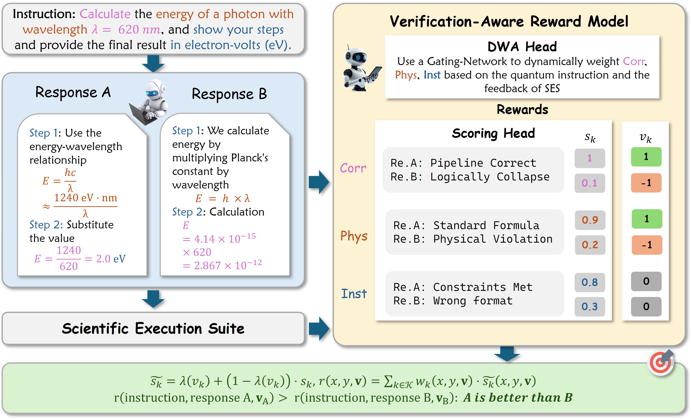

# QuantumQA: Enhancing Scientific Reasoning via Physics-Consistent Dataset and Verification-Aware Reinforcement Learning

[](https://aclanthology.org/2026.acl-long.1423/)
[](https://huggingface.co/datasets/qsxjack44/QuantumQA)
[](https://creativecommons.org/licenses/by-nc/4.0/)

## 📖 Abstract

Large language models (LLMs) show strong capabilities in general reasoning but typically lack reliability in scientific domains like quantum mechanics, which demand strict adherence to physical constraints. This limitation arises from the scarcity of verifiable training resources and the inadequacy of coarse feedback signals in standard alignment paradigms. To address the data challenge, we introduce **QuantumQA**, a large-scale dataset constructed via a task-adaptive strategy and a hybrid verification protocol that combines deterministic solvers with semantic auditing to guarantee scientific rigor. 

Building on this foundation, we propose the **verification-aware reward model (VRM)** tailored for Reinforcement Learning with Verifiable Rewards (RLVR), which employs an adaptive reward fusion (ARF) mechanism to dynamically integrate deterministic signals from a scientific execution suite (SES) with multidimensional semantic evaluations for precise supervision. Experimental results demonstrate that our method consistently outperforms baselines and general-purpose preference models. Notably, our optimized 8B model achieves performance competitive with proprietary models, validating that incorporating verifiable, rule-based feedback into the reinforcement learning loop offers a parameter-efficient alternative to pure scaling. 

---

## 📢 News
* **[2026-04]** Paper uploaded to arXiv! Check it out [here](https://arxiv.org/abs/2604.18176).
* **[2026-07]** Our paper has been published at ACL 2026! Read the official version on [ACL Anthology](https://aclanthology.org/2026.acl-long.1423/).
* **[2026-08]** QuantumQA is now open source! Please visit the [Hugging Face dataset](https://huggingface.co/datasets/qsxjack44/QuantumQA).

---

## 🚀 Key Contributions

### 1. The QuantumQA Dataset
QuantumQA is a large-scale dataset comprising 92,749 samples designed for verifiable scientific reasoning. 
* **Task Diversity:** Encompasses five distinct types of tasks: Short Answer, Fill-in-the-Blank, True/False, Multiple Choice, and Problem Solving. 
* **Hybrid Verification Protocol:** Integrates deterministic verification tools via our Scientific Execution Suite (SES) with semantic auditing to guarantee scientific rigor. 
* **Task-Adaptive Construction:** Mitigates hallucination by tailoring response structures to task complexity, enforcing conciseness for simple tasks and mandating detailed Chain-of-Thought (CoT) derivations for complex reasoning. 






### 2. Verification-Aware Reward Model (VRM)
Tailored for Reinforcement Learning with Verifiable Rewards (RLVR), our VRM effectively bridges the gap between general preference optimization and the rigorous supervision required for complex scientific reasoning. 
* Combines deterministic signals from the SES with multi-dimensional semantic evaluations (Mathematical Correctness, Physical Consistency, and Instruction Following). 
* Utilizes an **Dynamic Weight Allocation (DWA) head** to dynamically modulate supervision strength based on verifiability. 




## 📝 Citation

If you find our dataset or methodology helpful in your research, please consider citing our paper:

```bibtex
@inproceedings{qu-etal-2026-quantumqa,
    title = "{Q}uantum{QA}: Enhancing Scientific Reasoning via Physics-Consistent Dataset and Verification-Aware Reinforcement Learning",
    author = "Qu, Songxin  and
      Sun, Tai-Ping  and
      Wang, Yun-Jie  and
      Liu, Huan-Yu  and
      Xue, Cheng  and
      Xu, Xiao-Fan  and
      Fang, Han  and
      Yang, Yang  and
      Wu, Yu-Chun  and
      Guo, Guo-Ping  and
      Chen, Zhao-Yun",
    editor = "Liakata, Maria  and
      Moreira, Viviane P.  and
      Zhang, Jiajun  and
      Jurgens, David",
    booktitle = "Proceedings of the 64th Annual Meeting of the {A}ssociation for {C}omputational {L}inguistics (Volume 1: Long Papers)",
    month = jul,
    year = "2026",
    address = "San Diego, California, United States",
    publisher = "Association for Computational Linguistics",
    url = "https://aclanthology.org/2026.acl-long.1423/",
    doi = "10.18653/v1/2026.acl-long.1423",
    pages = "30821--30845",
    ISBN = "979-8-89176-390-6",
    abstract = "Large language models (LLMs) show strong capabilities in general reasoning but typically lack reliability in scientific domains like quantum mechanics, which demand strict adherence to physical constraints. This limitation arises from the scarcity of verifiable training resources and the inadequacy of coarse feedback signals in standard alignment paradigms. To address the data challenge, we introduce QuantumQA, a large-scale dataset constructed via a task-adaptive strategy and a hybrid verification protocol that combines deterministic solvers with semantic auditing to guarantee scientific rigor. Building on this foundation, we propose the verification-aware reward model (VRM) tailored for Reinforcement Learning with Verifiable Rewards (RLVR), which employs an adaptive reward fusion (ARF) mechanism to dynamically integrate deterministic signals from a scientific execution suite (SES) with multidimensional semantic evaluations for precise supervision. Experimental results demonstrate that our method consistently outperforms baselines and general-purpose preference models. Notably, our optimized 8B model achieves performance competitive with proprietary models, validating that incorporating verifiable, rule-based feedback into the reinforcement learning loop offers a parameter-efficient alternative to pure scaling."
}
```
